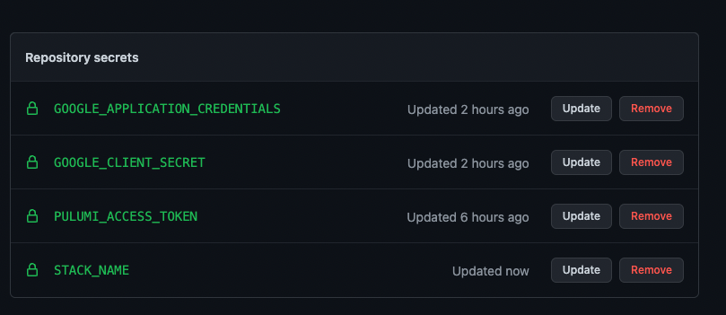

# YamlTube's Pulumi Provider

This repo contains a pulumi native provider for yamltube. It contacts and synchronizes YouTube playlists on your behalf.

If you want to use YamlTube, go fork the [YamlTube repo](https://github.com/mchaynes/yamltube)

### What does a YouTube playlist in Yaml look like?

```yaml
name: yaml-rickroll
runtime: yaml
description: A rick roll playlist
resources:
  rickroll:
    type: yamltube:youtube:Playlist
    properties:
      title: "Rick Roll"
      description: "I couldn't think of a better example"
      visibility: public
      videos:
        - https://www.youtube.com/watch?v=dQw4w9WgXcQ

outputs:
  # output a link to the playlist
  playlist: https://www.youtube.com/playlist?list=${rickroll.playlistId}
```

### Does this support other Pulumi supported languages?

```yaml
name: yamltube
runtime: yaml
description: a spotify playlist
resources:
  makingmyway:
    type: yamltube:spotify:Playlist
    properties:
      title: Walkin Fast
      tracks:
        - link: https://open.spotify.com/track/4w1lzcaoZ1IC2K5TwjalRP
        # or
        - title: A Thousand Miles
          artist: Vanessa Carlton
          album: Be Not Nobody
        # or
        - isrc: USIR10210955 # https://www.isrcfinder.com/
outputs:
  # outputs link like: https://open.spotify.com/playlist/37i9dQZF1DX8NTLI2TtZa6
  makingmywayLink: ${makingmyway.link}
```

## Setup Instructions

### 0. An apology for even having to do any of this

All these steps shouldn't be necessary. We should be able to link our github identity with a google identity somehow completely through the web
then we should be able to store those credentials in github secrets automatically. The main issue is that you've got to create your own oauth app and get that `client_secret.json` file. Otherwise I could just prompt you from the first run of a github action run.

I could in theory create an app that other people could use but I don't know enough about this stuff to say whether that works. 

I hope there's a better way to do this long term

### 1. Fork this repo

Pretty straightforward

<details>

<summary> private repo instructions </summary>

```sh
  git clone https://github.com/mchaynes/yamltube.git
  cd yamltube
  git remote add private git@github:mchaynes/private.git
  git push private main
  👁👄👁
```

</details>


### 2. Sign up for Pulumi and install the CLI.

1. You can probably just do a `brew install pulumi && pulumi login`. Or go read the [docs](https://www.pulumi.io/)
2. Obtain a [Pulumi Access Token](https://www.pulumi.com/docs/intro/pulumi-service/accounts/#access-tokens)

### 3. Get Credentials To Access YouTube API

Obtain a `client_secret.json` for your account. Follow this [Guide](https://developers.google.com/youtube/v3/guides/auth/server-side-web-apps) to get the file. (Sorry, no Pulumi program for this)

### 4. Generate `application_credentials.json`

Run `go build && ./verify`

```
$ go build && ./verify
Rick Roll              https://www.youtube.com/playlist?list=PLeQFt2AXw9mQpVhWC5lS7zst-WAcubVk5
Making My Way Downtown https://www.youtube.com/playlist?list=PLeQFt2AXw9mQNM6J7WA_v37PvOdXBYtG-

Successfully saved ./application_credentials.json
Run:
    export GOOGLE_APPLICATION_CREDENTIALS="$(cat ./application_credentials.json)"
    export GOOGLE_CLIENT_SECRET="$(cat ./client_secret.json)"
```

### 5. Modify and create your playlists

1. Modify `Pulumi.yml` and add your playlists

1. Run `pulumi up`

```sh
❯ pulumi up
Please choose a stack, or create a new one: myleschaynes
Previewing update (myleschaynes)

View Live: https://app.pulumi.com/myles/yamltube/myleschaynes/previews/<redacted>

     Type                          Name                   Plan
 +   pulumi:pulumi:Stack           yamltube-myleschaynes  create
 +   ├─ yamltube:youtube:Playlist  makingmyway            create
 +   └─ yamltube:youtube:Playlist  rickroll               create

Resources:
    + 3 to create

Do you want to perform this update? yes
Updating (myleschaynes)

View Live: https://app.pulumi.com/myles/yamltube/myleschaynes/updates/1

     Type                          Name                   Status
 +   pulumi:pulumi:Stack           yamltube-myleschaynes  created
 +   ├─ yamltube:youtube:Playlist  rickroll               created
 +   └─ yamltube:youtube:Playlist  makingmyway            created

Outputs:
    makingmywayLink: "https://www.youtube.com/playlist?list=PLeQFt2AXw9mS-8BzL96OkySMOTArBTA0O"
    rickrollLink   : "https://www.youtube.com/playlist?list=PLeQFt2AXw9mSQKAyZTPhMvO080-mOAkMJ"

Resources:
    + 3 created

Duration: 4s
```

### 6. Github Actions Setup (Optional, but you really should)

Go to your forked repo, click `Settings` > `Secrets` > `Actions`

```
+--------------------------------+--------------------------------------------+
|          Secret Name           |                   Value                    |
+--------------------------------+--------------------------------------------+
| GOOGLE_CLIENT_SECRET           | contents of ./client_secret.json           |
| GOOGLE_APPLICATION_CREDENTIALS | contents of ./application_credentials.json |
| PULUMI_ACCCESS_TOKEN           | <token> from ui                            |
| STACK_NAME                     | name of the pulumi stack                   |
+--------------------------------+--------------------------------------------+
```


